# 🩺 **Doctor-Patient Consultancy System**  
*A Production-Ready Healthcare Appointment & Scheduling Platform*  
👨‍⚕️👩‍⚕️📅💊  

<p align="center">
  
  
  
  
  
  
</p>

---

# 📑 **Table of Contents**
- [🩺 Doctor-Patient Consultancy System](#-doctor-patient-consultancy-system)
  - [🚀 Project Overview](#-project-overview)
  - [🎯 Why Recruiters Will Love This](#-why-recruiters-will-love-this)
  - [✨ Key Features (Impact-Oriented)](#-key-features-impact-oriented)
  - [🛠 Tech Stack](#-tech-stack)
  - [🧠 Skills Demonstrated](#-skills-demonstrated)
  - [🗄️ Database Models (ERD)](#️-database-models-erd)
  - [🏛️ System Architecture Diagram](#️-system-architecture-diagram)
  - [🎞️ Appointment Booking Workflow](#️-appointment-booking-workflow)
  - [📦 Installation Guide](#-installation-guide-local-development)
  - [🚀 Deployment (Railway)](#-deployment-railway)
  - [🖼️ Screenshots](#️-screenshots-add-later)
  - [📊 Real-World Use Cases](#-real-world-use-cases)
  - [🚧 Roadmap](#-roadmap)
  - [👤 Author](#-author)
  - [📄 License](#-license)

---

# 🚀 **Project Overview**
The **Doctor-Patient Consultancy System** is a secure, scalable Django-based healthcare platform that enables:

- Efficient appointment booking  
- Doctor–Patient management  
- Medical record storage  
- Role-based scheduling functionality  
- Production deployment with PostgreSQL & Railway  

This project is built with a **production-first mindset**, ideal for recruiters evaluating backend engineering capability.

---

# 🎯 **Why Recruiters Will Love This**
- 💼 Real-world healthcare workflow  
- 🏗 Professional backend architecture  
- 🔐 Strong security (CSRF, env vars, hashed passwords)  
- 🗄 PostgreSQL relational model with ERD  
- 🚀 Live production-level deployment skills  
- 📅 Complex scheduling logic  

---

# ✨ **Key Features (Impact-Oriented)**

## 👨‍⚕️ Doctor Module
- Manage professional profile  
- Approve / cancel / complete appointments  
- Dashboard showing upcoming patients  
- Authentication + secure session handling  

---

## 🧑‍🦰 Patient Module
- Signup/login securely  
- Update profile & medical history  
- Find doctors by name/specialization  
- View appointment history  

---

## 📅 Appointment Management
- Auto 30-min slot generation (9AM–5PM)  
- Double-booking prevention  
- Appointment lifecycle:  
  **Pending → Approved → Completed / Cancelled**  
- Transaction-safe workflows  

---

# 🛠 **Tech Stack**
| Layer | Technology |
|-------|------------|
| Backend | Django 5.2, Python 3.11 |
| Database | PostgreSQL |
| Deployment | Railway |
| Frontend | Django Templates (HTML/CSS) |
| Security | Django Auth, CSRF, Validation |

---

# 🧠 **Skills Demonstrated**
✔ Django MVC Architecture  
✔ Scheduling & Appointment Logic  
✔ Secure Authentication  
✔ PostgreSQL Schema Design  
✔ Environment Variable Security  
✔ Production Deployment (Railway + Gunicorn)  
✔ Template Rendering  
✔ Form Validation  
✔ CSRF + Session Security  

---

# 🗄️ **Database Models (ERD)**

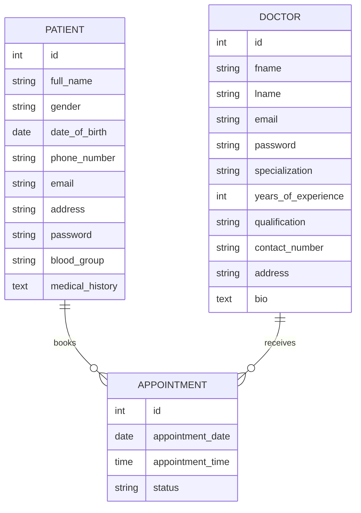

---

# 🏛️ **System Architecture Diagram**

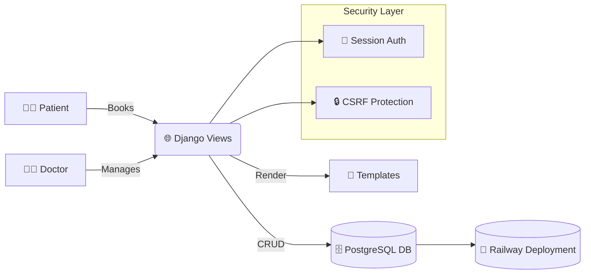

---

# 🎞️ **Appointment Booking Workflow**

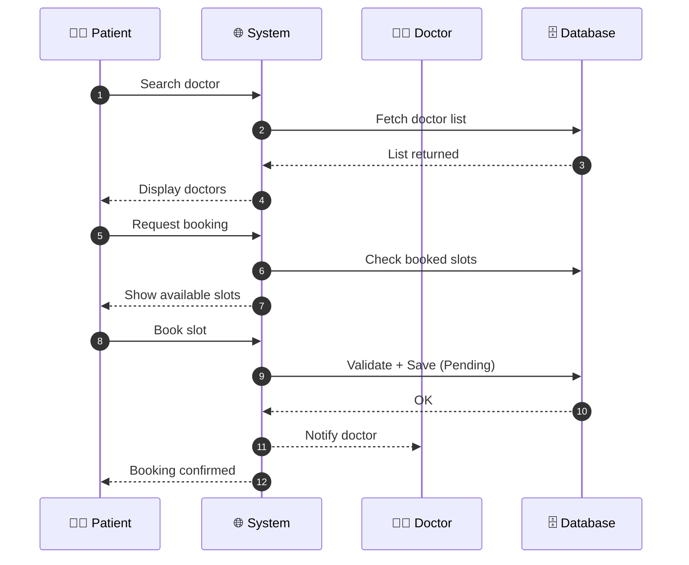

---

# 📦 **Installation Guide (Local Development)**

```bash
git clone <repo-url>
cd doctor_patient_consultancy

python -m venv venv
source venv/bin/activate   # Windows: venv\Scripts\activate

pip install -r requirements.txt
cp .env.example .env
python manage.py migrate
python manage.py createsuperuser
python manage.py runserver
```

---

# 🚀 **Deployment (Railway)**

```bash
railway login
railway init

railway variables set SECRET_KEY="..."
railway variables set DATABASE_URL="postgres://..."
railway variables set DEBUG="False"
railway variables set RAILWAY_PUBLIC_DOMAIN="your-app.up.railway.app"

railway up
```

**Production Server:**

```bash
gunicorn doctor_patient_consultancy.wsgi:application --bind 0.0.0.0:$PORT --workers 3
```

---

# 🖼️ Screenshots

---

## 🏠 Home Page
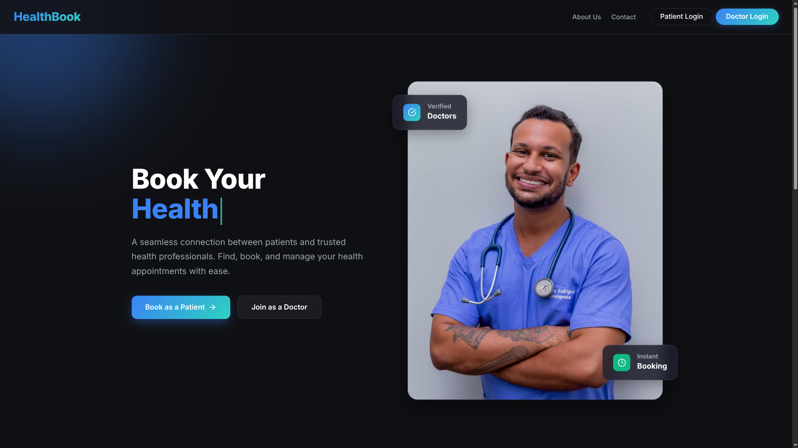

---

## 🔐 Doctor Login Page
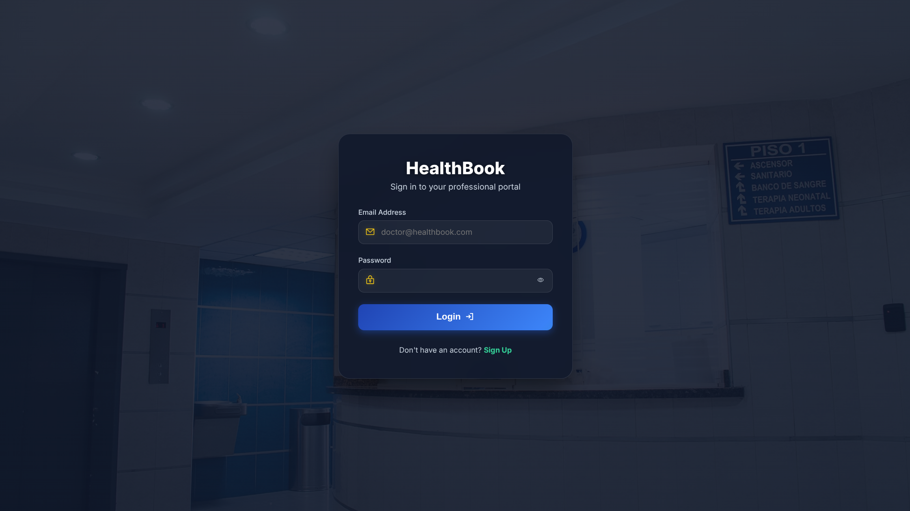

---

## 🔐 Patient Login Page
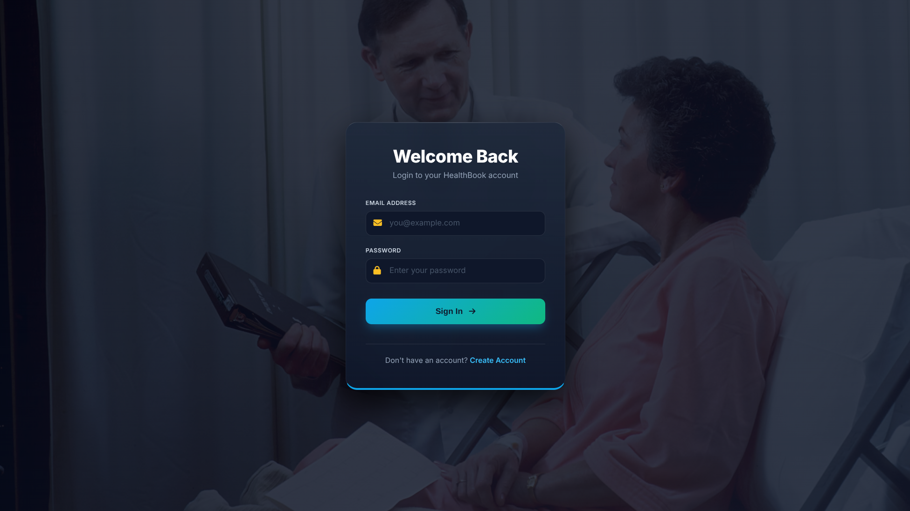

---

## 🏠 Patient Dashboard
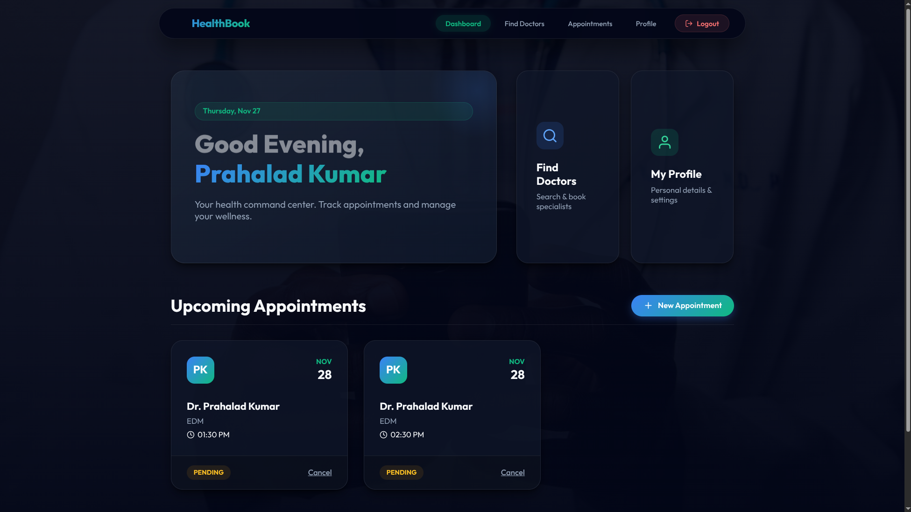

---

## 👨‍⚕️ Doctor Dashboard
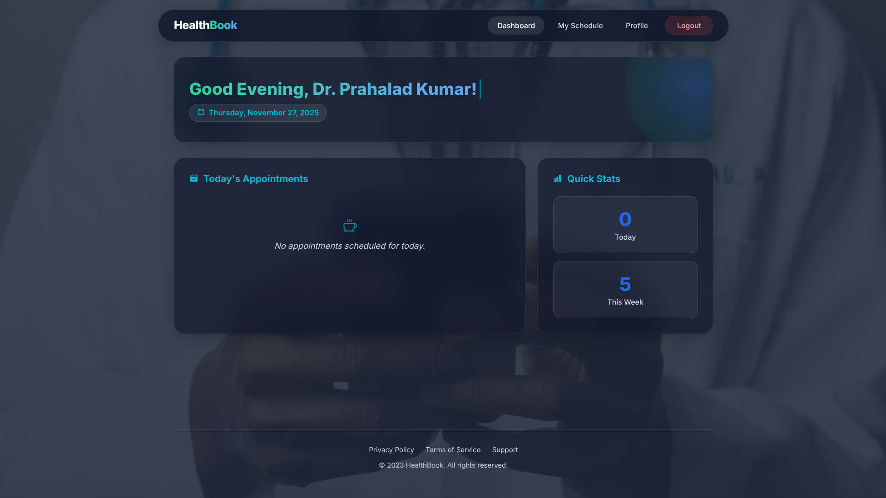

---

## 👨‍⚕️ Doctor Profile
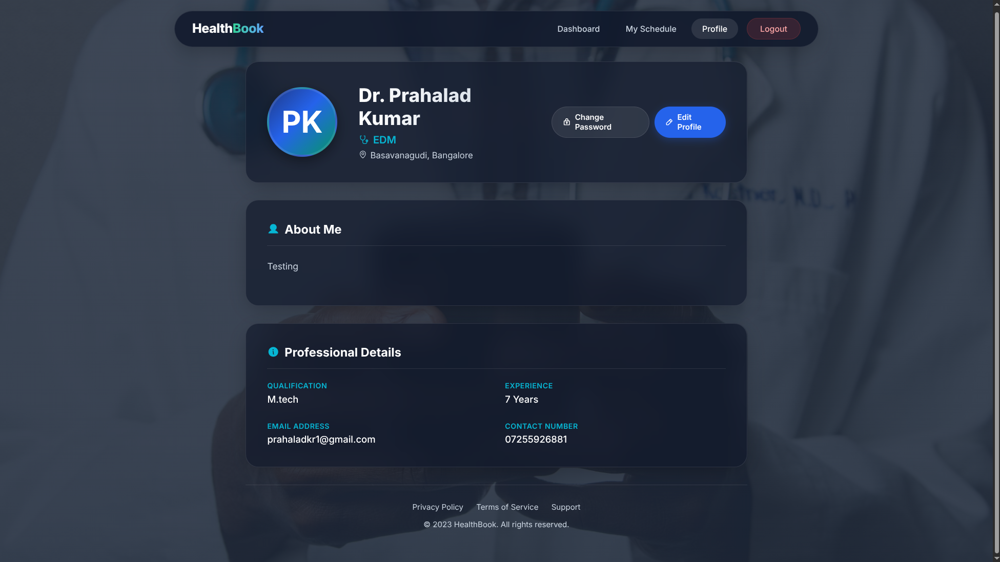

---

## 👤 Patient Profile
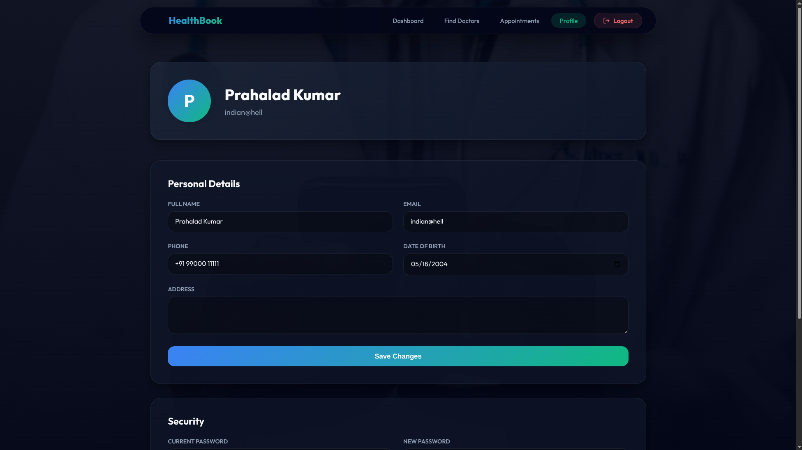

---

## 📝 Doctor Profile Update
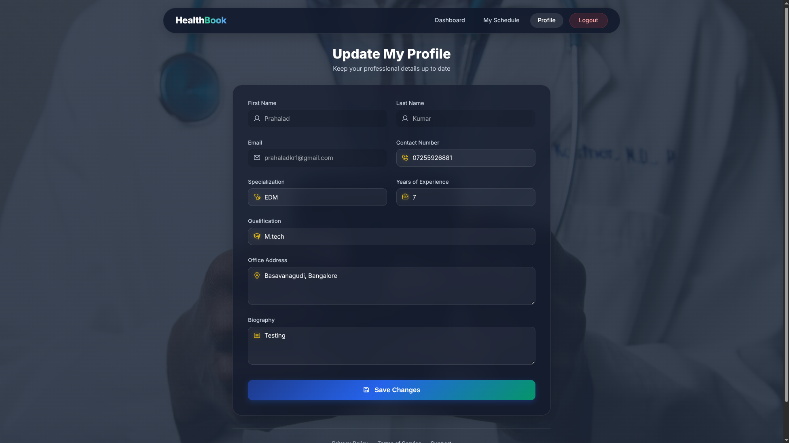

---

## 📝 Doctor find Page
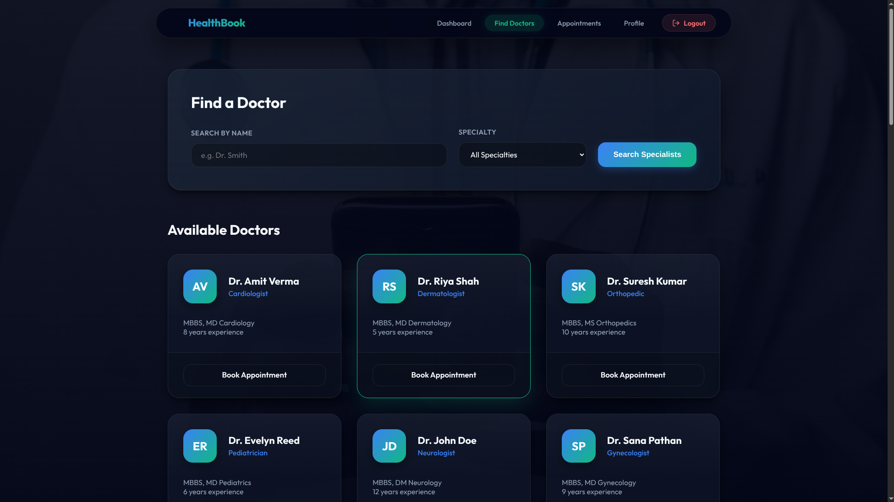

---

## 📅 Appointment Booking
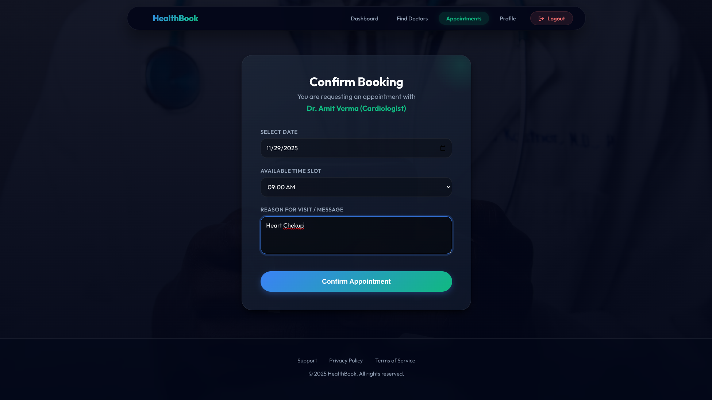

---

## 📋 Doctor Appointment Management


---

# 📊 **Real-World Use Cases**
- Private clinics  
- Telemedicine startups  
- Hospital scheduling backend  
- Healthcare MVP validation  
- Backend engineer portfolio projects  

---

# 🚧 **Roadmap**
- SMS/email reminders  
- Doctor–patient chat  
- RBAC (Admin/Doctor/Patient roles)  
- Analytics dashboard  
- Calendar sync  
- Prescription uploads  

---

# 👤 **Author**
**PRAHALAD KUMAR**  
Python Developer | Backend Engineer  
📧 Email: **Prahaladkr1@gmail.com**  
🐙 GitHub: https://github.com/Prahalad-kumar  
🔗 LinkedIn: https://www.linkedin.com/in/prahalad-kumar-86a81a327/  

---

# 📄 **License**
MIT License  
