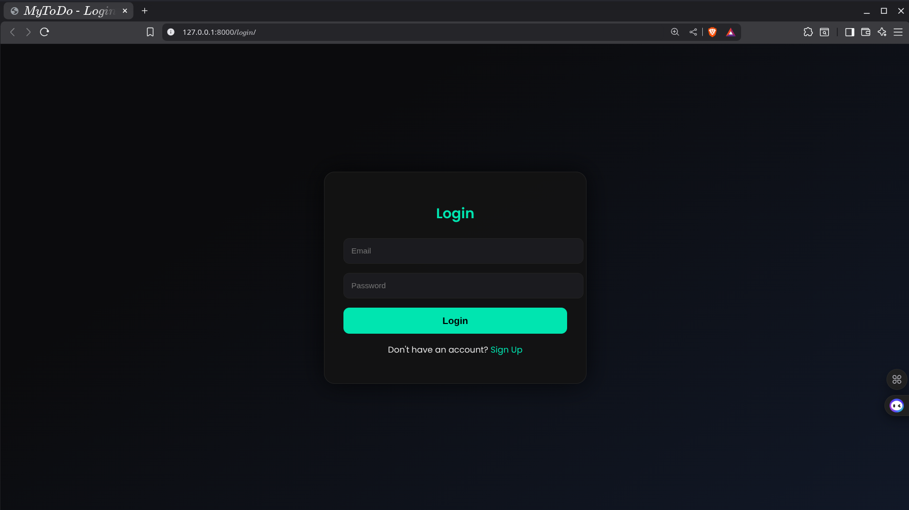
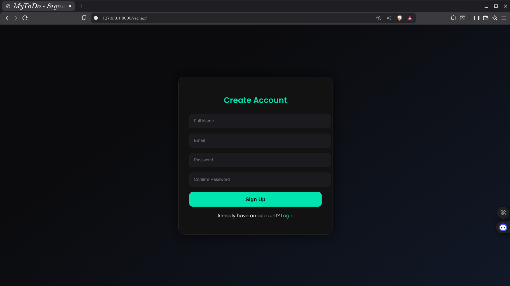
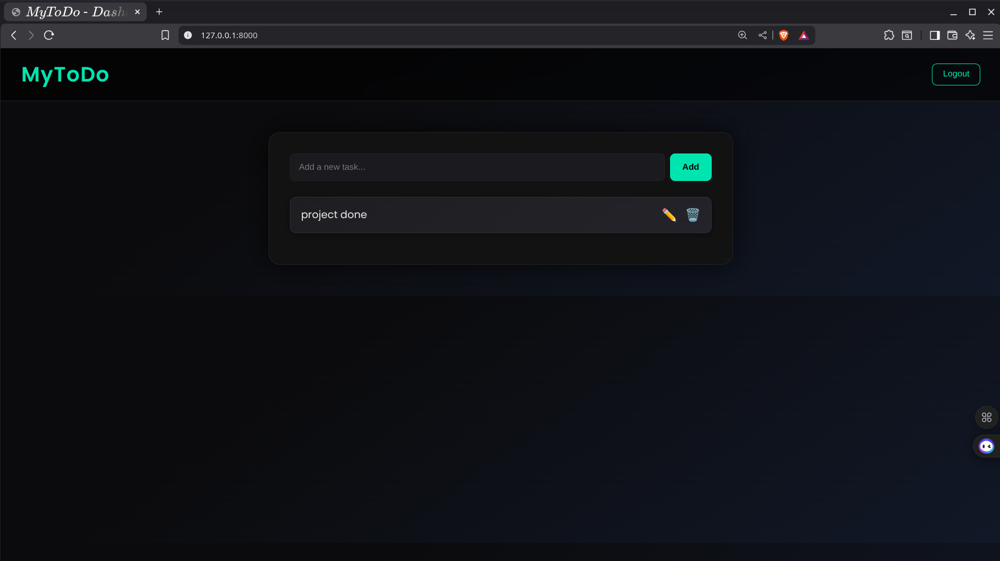
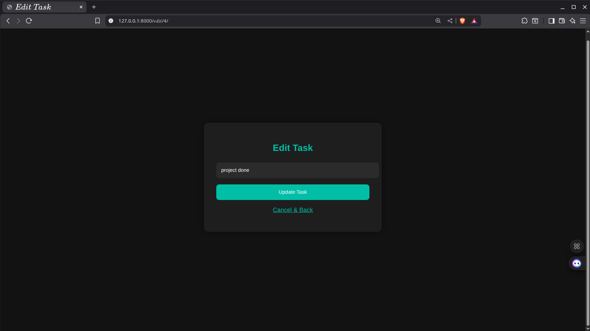
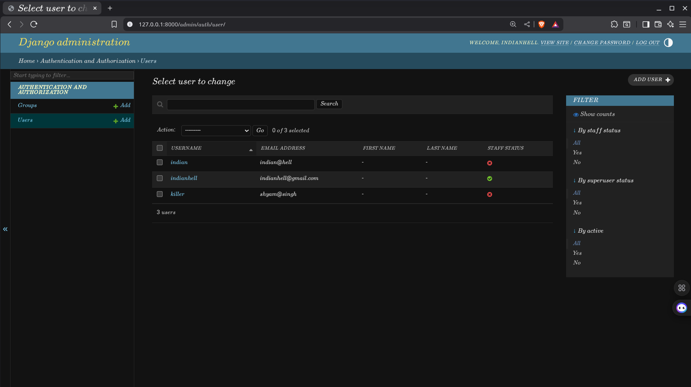

# 🌟 MyToDo - Django Task Manager


A **dark-themed, neon-highlighted Django ToDo application** to manage your daily tasks in style!  

---

## 💡 Features

- 🔐 **User Authentication**: Signup, login, and logout.  
- ✅ **Task CRUD**: Add, edit, delete, and toggle tasks.  
- 🌈 **Dark Neon UI**: Smooth gradients, shadows, and hover effects.  
- 📱 **Responsive Design**: Works on mobile, tablet, and desktop.  
- 👤 **Per-User Tasks**: Each user sees only their tasks.

---

## 📂 Project Structure

```
todo_ap/
├── manage.py
├── requirements.txt
├── db.sqlite3
├── todo_ap/
│   ├── settings.py
│   ├── urls.py
│   └── wsgi.py
├── todo/
│   ├── models.py
│   ├── views.py
│   ├── admin.py
│   ├── apps.py
│   ├── migrations/
│   └── templates/
│       ├── home.html
│       ├── todo.html
│       ├── login.html
│       ├── signup.html
│       └── edit_task.html
└── README.me
```

---

## 🎨 UI & UX

- **Dashboard**: Add tasks, view all tasks, mark completed/pending.  
- **Task Actions**:
  - ✏️ Edit  
  - 🗑️ Delete  
  - ✅ Toggle complete  
- **Header**: Neon logo + logout button  
- **Forms**: Smooth neon borders & focus effects  

---

## ⚡ Routes & URLs

| URL | Description |
|-----|-------------|
| `/` | Dashboard / Home |
| `/add_task/` | Add new task |
| `/edit_task/<srno>/` | Edit a task |
| `/delete_task/<srno>/` | Delete a task |
| `/toggle/<srno>/` | Toggle task completion |
| `/login/` | Login page |
| `/signup/` | Signup page |
| `/logout/` | Logout user |

---

## 🚀 Installation

```bash
# Clone the repo
git clone <your-repo-url>
cd todo_ap

# Create & activate virtual environment
python -m venv .venv
source .venv/bin/activate   # Linux/Mac
.venv\Scripts\activate      # Windows

# Install dependencies
pip install -r requirements.txt

# Run migrations
python manage.py makemigrations
python manage.py migrate

# Start development server
python manage.py runserver
```

Open `http://127.0.0.1:8000/` in your browser 🌐

---

## 📸 Screenshots

To include screenshots in your README:  

1. Create a folder in your repo called `screenshots/`.  
2. Add your images there (e.g., `login.png`, `signup.png`, `dashboard.png`).  
3. Use Markdown to display images:

```markdown



```

Example:

| Login Page | Signup Page |
|------------|-------------|
|  |  |

| Dashboard | Edit Task |
|-----------|-----------|
|  |  |

| Admin Page | Admin_user Page |
|------------|-------------|
|  |  |

---

## 👤 Usage

1. Signup & login.  
2. Add new tasks using the input box.  
3. Click tasks to mark as completed/pending.  
4. Edit/Delete tasks using icons.  
5. Logout when finished.  

---

## 🔮 Future Enhancements

- Task categories & priorities  
- Due dates & reminders  
- Drag & drop task reordering  
- Task search & filtering  
- Toast notifications for actions  

---

## 💖 License

MIT License © 2025  
Crafted with ❤️ by **Prahalad Kumar**  

> Made with **Django + Python + Neon Vibes**